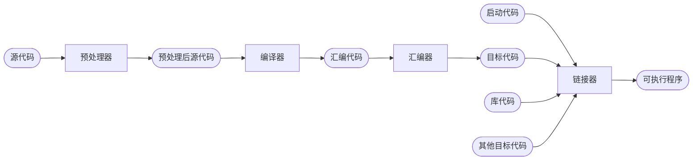

## 引言

本文主要介绍在Linux系统上C++的开发和编程所需要用到的工具，主要内容有：GCC、静态库、动态库、Makefile、GDB、CMake等主流C++编程工具。

**本文持续更新中**

# GCC

GCC全称为GNU Compiler Collection，是由GNU开发的编程语言编译器，GNU编译套件编译包括C、C++、Obeject-C、Java和Go等，也包括了这些语言的库，本文主要介绍GCC在C/C++上的编译应用。


## GCC的工作流程



1. 图中的源代码一般是.c、.h、.cpp文件。
2. 首先经过预处理器后得到.i文件，**预处理器的作用是展开头文件、宏替换、删除注释等。**
3. 其次经过编译器把.i文件中的代码转换为汇编代码.s文件，**编译器的作用则是将预处理后源代码编译成汇编代码**。
4. 随后通过汇编器将汇编代码.i文件转换为目标代码.o文件（机器代码），**汇编器的作用则是将汇编代码转换为二进制指令**。
5. 最后将不同的.o文件链接成一个可执行程序.exe（windows）或者.out（linux）文件即可，**链接器的作用则是链接各种代码形成可执行程序**。


## GCC常用参数

| GCC参数选项                        | 作用                                                         |
| ---------------------------------- | ------------------------------------------------------------ |
| -E                                 | 预处理指定文件                                               |
| -S                                 | 编译指定文件（包括了预处理，但是不会进行汇编）               |
| -c                                 | 编译、汇编指定文件（不进行链接）                             |
| -o [app] [src]<br />[src] -o [app] | 将文件src编译成可执行文件app                                 |
| -I [directory]                     | i大写，指定#include包含的搜索目录（静态库需要使用）          |
| -g                                 | 在编译时候生成调试信息（GDB需要使用）                        |
| -D                                 | 在程序编译的时候，指定一个宏                                 |
| -w                                 | 不生成任何警告信息                                           |
| -Wall                              | 生成所有警告信息                                             |
| -O0/O1/O2/O3                       | 编译器优化的4个级别，O0表示没有优化，O1为缺省值，O3优化级别最高 |
| -l                                 | 小写L，指定编译时候，所要包含的库（静态库需要使用）          |
| -L                                 | 库的搜索路径（静态库需要使用）                               |
| -fPIC/fpic                         | 生成与位置无关的代码（动态库需要使用）                       |
| -shared                            | 生成共享目标文件（建立共享库或称动态库）                     |
| -std                               | 指定C语言的编译标准，如有-std=c99                            |

使用样例：

```shell
gcc test.c -E -o test.i # test.cpp -> test.i（预处理代码）

gcc test.i -S -o test.s # test.i -> test.s（汇编代码）

gcc test.s -c -o test.o # test.s -> test.o（机器代码/二进制文件）

gcc test.c -o app # test.cpp -> app（可执行程序）

# -I 参数在静态库的样例中查看

# -g 参数在GDB的样例中查看

# 定义了一个DEBUG宏，如果代码中存在宏的条件编译
# 如#ifdef DEBUG ... #else ... #endif，则会判断是否定义了DEBUG
# 定义了则会编译#ifdef中的内容，否则是else的内容
gcc test.c -o test -D DEBUG 
gcc test.c -o test -w # 不生生成任何的warning，比如定义的变量没有使用等

gcc test.c -o -Wall # 生成所有的warning

gcc test.c -o test -O3 # 对程序进行“臭氧”优化

# -l 参数在静态库的样例中查看

# -L 参数在静态库的样例中查看

# -fPIC/fpic 参数在动态库的样例中查看

# -shared 参数在动态库的样例中查看

g++ test.cpp -o test -std=c++11

```


# 静态库

静态库是指**在程序的链接阶段被复制到目标程序当中的库**。

静态库的优点：

1. 静态库被打包到到应用程序中加载速度快
2. 发布程序无需提供静态库，移植方便

静态库的缺点：

1. 消耗系统资源，浪费内存（如果有多个程序使用了此静态库，则静态库会被编译多次）
2. 更新、部署、发布麻烦（如果更新了静态库，则需要重新编译使用了此静态库的源代码）


## 静态库的制作

> 命名规则：**Linux系统中命名格式为libxxx.a**（lib和.a固定，xxx是库的名称），**Windows系统中格式则是libxxx.lib**

1. 通过gcc获得.o文件
2. 使用ar工具将.o文件打包，命令如下：

```shell
ar rcs libxxx.a file1.o file2.o # xxx.o ...  
```

参数rcs分别表示：

- r —— 往备存文件（或称库文件）中插入.o文件
- c —— 建立备存文件（或称库文件）
- s —— 生成.o文件的索引

制作样例：

```shell
# 假设有以下文件：
#-add.c
#-div.c
#-head.h
#-main.c
#-mult.c
#-sub.c

gcc -c add.c div.c mult.c sub.c # 生成对应的.o文件

ar rcs libcalc.a add.o sub.o mult.o div.o # 生成libcalc.a静态库文件
```


## 静态库的使用

```shell
# 假设有以下文件：
#-include/
#	-head.h
#-lib/
#	-libcalc.a
#-main.c

gcc main.c -o app -I ./include/ -l calc -L ./lib/ # -I表示包含的头文件位置，-l表示包含的库文件名称，-L表示库的搜索目录

./app # 执行程序
```


# 动态库

动态库是指**在程序编译时不被链接到目标代码中，而是在程序运行时才被载入的库**。

动态库的优点：

1. 可以实现进程间资源共享（各个应用程序都可以共享载入到内存中的动态库）
2. 更新、部署、发布简单（每次更新只需要重新编译库文件即可）
3. 可以控制何时加载动态库（使用到的时候才会去加载）

动态库的缺点：

1. 加载速度比静态库慢
2. 发布程序时需要提供依赖的动态库


## 动态库的制作

> 命名规则：**Linux系统中命名格式为libxxx.so**（lib和.so固定，xxx是库的名称），**Windows系统中格式则是libxxx.dll**

1. 通过gcc得到.o文件，需要得到和位置无关的代码（-fpic/-fPIC）
2. 通过gcc得到动态库

制作样例：

```shell
gcc -c -fpic add.c div.c mult.c sub.c # xxx.c ...
gcc -shared *.o -o libcalc.so
```


## 动态库的使用

```sh
# 假设有以下文件：
#-include/
#	-head.h
#-lib/
#	-libcalc.so
#-main.c

gcc main.c -o main -I include/ -L lib/ -l calc # 编译

./main # 执行
# 结果输出
./main: error while loading shared libraries: libcalc.so: cannot open shared object file: No such file or directory
```

**动态库是在程序启动之后动态地加载到内存中，因此需要给定库文件的路径，一般情况下如果没有设定库文件路径，直接编译使用了动态库的源代码会报not found的错误**，此时可以通过ldd（list dynamic dependencies）命令检查动态库依赖关系：

```shell
ldd app
```

Linux系统下的动态库载入需要系统的动态载入器来获取其绝对路径，找到库文件后再将其载入内存即可，对于elf格式的可执行程序是由ld-linux.so来完成的，**搜索路径如下所示：**

1. elf文件的**DT_RPATH段**（不常用，用gcc加入链接操作-Wl -rpath指定搜索路径）

2. 环境变量**LD_LIBRARY_PATH**

   通过以下指令：

   ```shell
   export LD_LIBRARY_PATH=$LD_LIBRARY_PATH:库的绝对路径(比如/usr/xxx/mylib/)
   ```

   来添加，这是一种临时的配置，随着终端的退出就会失效，如果想要永久配置，有两种配置方式：

   - 用户级别的配置

     进入/home/用户名/.bashrc文件，在文件末尾添加以上export指令，然后输入**source .bashrc**来更新配置即可。

   - 系统级别的配置

     进入etc/profile文件，在文件末尾添加以上export命令，然后更新配置即可。

3. **/etc/ld.so.cache**文件列表

   **ld.so.cache**是一个二进制文件，无法直接修改，需要通过修改同目录下的**ld.so.conf**文件来完成配置，将路径直接加入到文件，然后使用**ldconfig**指令来更新配置即可。

4. **/lib/**或者**/lib64/**（不推荐使用，因为有很多库文件，可能会出现同名替换的问题）

5. **/usr/lib/**或者**/usr/lib64/**（不推荐使用，因为有很多库文件，可能会出现同名替换的问题）

最后编译程序和执行程序就可以正常通过了：

```shell
gcc main.c -o main -I include/ -L lib/ -l calc # 编译
./main # 执行
```


# Makefile

Makefile文件定义了一系列的规则来指文件的编译顺序，其作用就是为了自动化编译，使用make指令来完全自动的编译。

## Makefile文件命名和规则

- 文件命名

  makefile或者Makefile命名的文件

- Makefile规则

  - 一个Makefile文件可以有一个或者多个规则，其规则模板如下：

    ```makefile
    目标 ...: 依赖 ...
    	命令（shell 命令）
    	...
    ```

    - 目标：最终要生成的文件（伪目标除外）
    - 依赖：生成目标所需要的文件或者目标
    - 命令：通过执行命令对依赖操作生成目标（命令前必须Tab缩进）

  - Makefile中的其他规则一般都是为第一条规则服务的


# GDB


# CMake


## 参考资料
[1].  [牛客网——C++高薪面试项目](https://www.nowcoder.com/courses/cover/live/504)

[2].  [CSDN——Linux下动态库(共享库）的制作与使用](https://blog.csdn.net/weixin_51483516/article/details/120621135)

[3].  [知乎——linux设置程序搜索动态库路径](https://zhuanlan.zhihu.com/p/383824348)